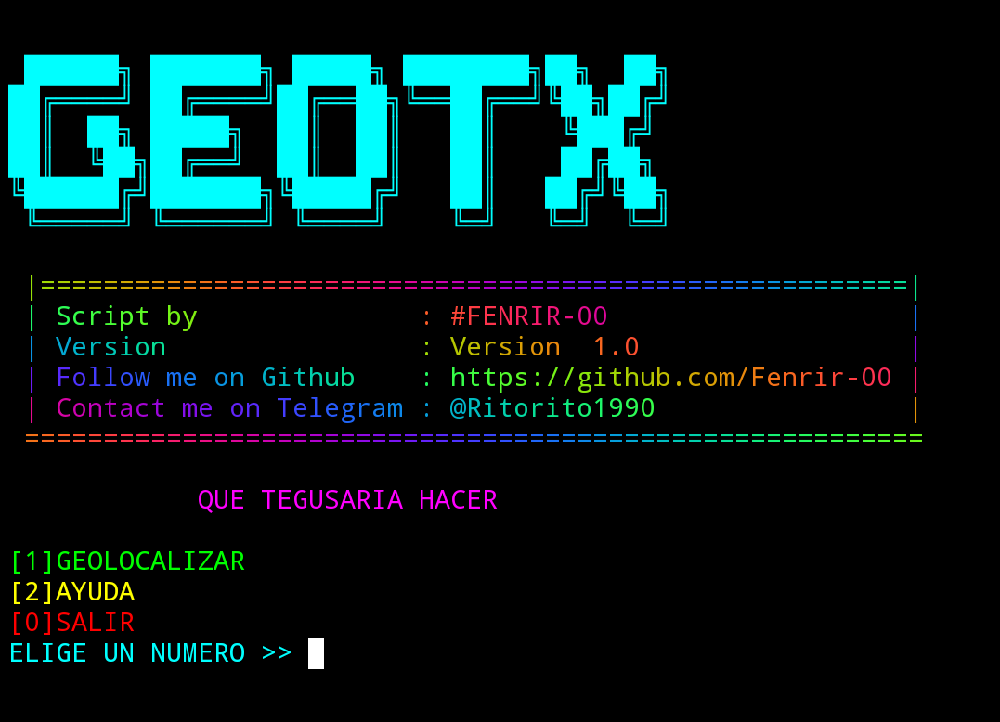
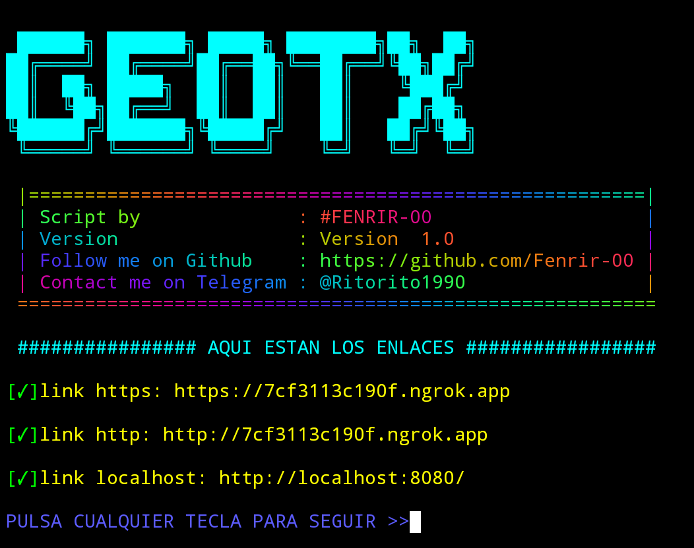
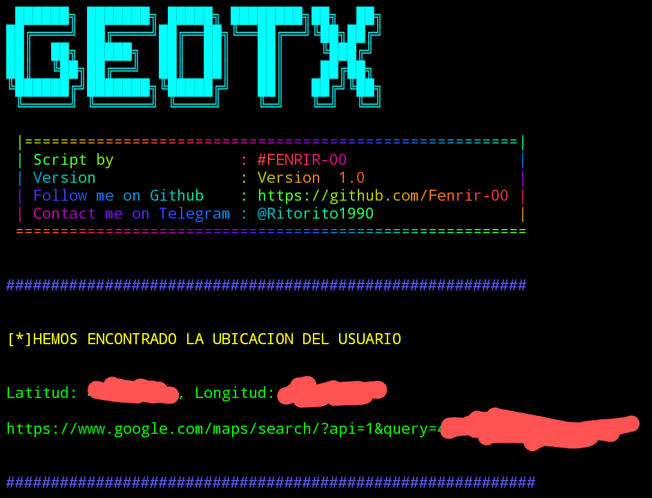

# instalación

``` bash

pkg install git

```

```bash

pkg install python

```

```bash

git clone https://github.com/Fenrir-00/geotx

```

```bash

cd geotx 

```

```bash

python3 geotx.py

```

# SOLO PARA FINES EDUCATIVOS

# NO ME HAGO RESPONSABLE DEL MAL USO
